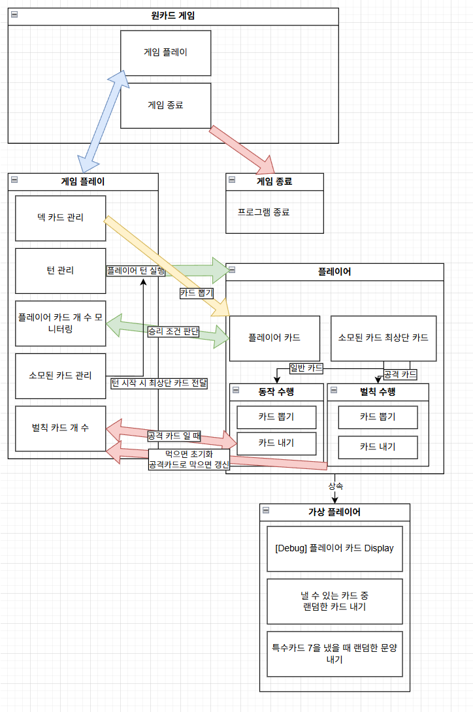

# OneCard
원카드 콘솔 프로젝트 제작

**게임 룰**

1. 플레이어는 카드를 각각 7장 씩 나눠 가진다.
2. 플레이어는 자신의 차례에 카드를 내거나 하나도 못 내려놓을 시 한장 덱에서 카드를 가져온다. 
3. 카드는 이미 내어진 카드의 숫자나 문양이 같아야 한다.
4. 공격 카드와 특수카드는 별도의 효과를 발휘한다.
5. 만약 자신이 카드를 내려 놓았을 때 자신의 패가 1장이라면 원카드를 제일 먼저 외쳐야 한다. 못하면 1장을 덱에서 뽑는다.
6. 자신의 패가 20장을 넘어가면 패배한다.
7. 가장 먼저 모든 카드를 내려 놓는 사람이 승리한다.

**문양카드**

*공격*
컬러 조커 : 다음 상대에게 5장의 카드를 먹인다.
흑색 조커 : 다음 상대에게 7장의 카드를 먹인다.
스페이드 A : 다음 상대에게 5장의 카드를 먹인다.
이외의 A : 다음 상대에게 3장의 카드를 먹인다.
2 : 다음 상대에게 2장의 카드를 먹인다.

공격카드는 공격카드로 먹일 카드 장 수를 누적하여 다음 상대에게 넘길 수 있다.
다만 넘길 수 있으려면 공격 카드의 능력이 더 강해야 한다.
(컬러 조커 > 흑색조커 > 스페이드 A > A > 2)

*특수 카드*
Q : 플레이어 턴 순서를 바꾼다.
J : 플레이어 턴을 스킵한다.
K : 플레이어 턴에 카드를 한 장 더 낸다. (만약 낼 수 없다면 한 장 뽑는다)
7 : 내려놓은 카드의 문양을 변경한다.

---
## 초기 구상도
